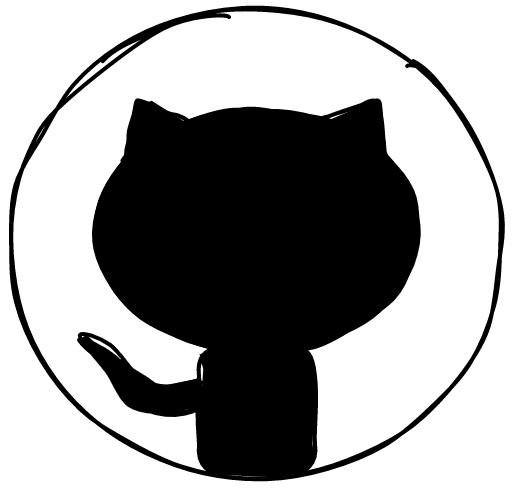
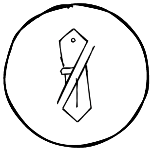

<!-- **RustyTake-Off/RustyTake-Off** is a ✨ _special_ ✨ repository because its `README.md` (this file) appears on your GitHub profile. -->
# Hello there 👋

<!-- Main section -->

  

  
  &#8287;
  
  &#8287;

<!-- Pinned repositories section -->

<!-- Stats section -->

<!-- Footer section -->

  

